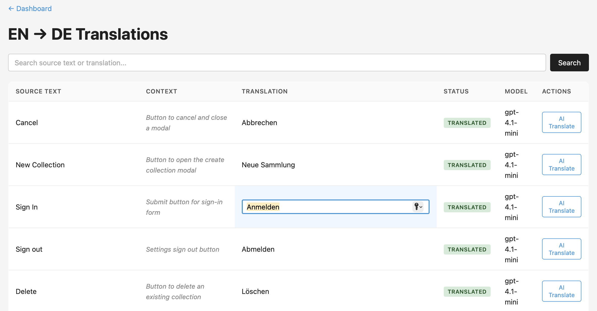

# TransDuck UI

A lightweight web interface for browsing and editing translations in a TransDuck SQLite database.



## Setup

1. Clone this repo into your project directory (next to `transduck.yaml`):

   ```bash
   cd your-project
   git clone https://github.com/timnilson/transduck-ui.git
   ```

2. Create a virtual environment and install dependencies:

   ```bash
   cd transduck-ui
   python3 -m venv .venv
   source .venv/bin/activate
   pip install -r requirements.txt
   ```

3. Make sure your project has a `transduck.yaml` in the parent directory. If not:

   ```bash
   cd ..
   transduck init
   ```

4. Run the UI:

   ```bash
   cd transduck-ui
   source .venv/bin/activate
   python app.py
   ```

5. Open http://localhost:5555

## Features

- Browse translations by target language
- Search by source text or translated text
- Click any translation to edit it inline (saves as `model: "human"`)
- AI Translate button to re-translate any string using your configured provider
- Dashboard shows project details, language stats, and translation counts

## Adding to .gitignore

Add `transduck-ui/` to your project's `.gitignore` — this is a local dev tool, not deployed code.
